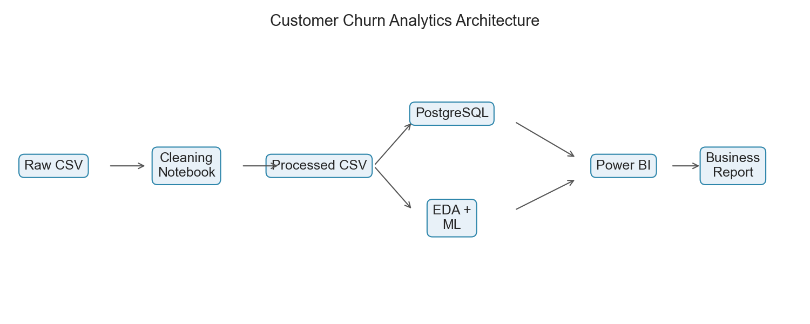
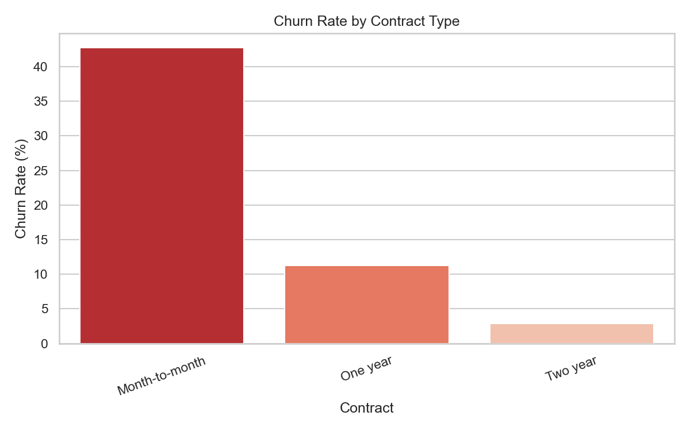
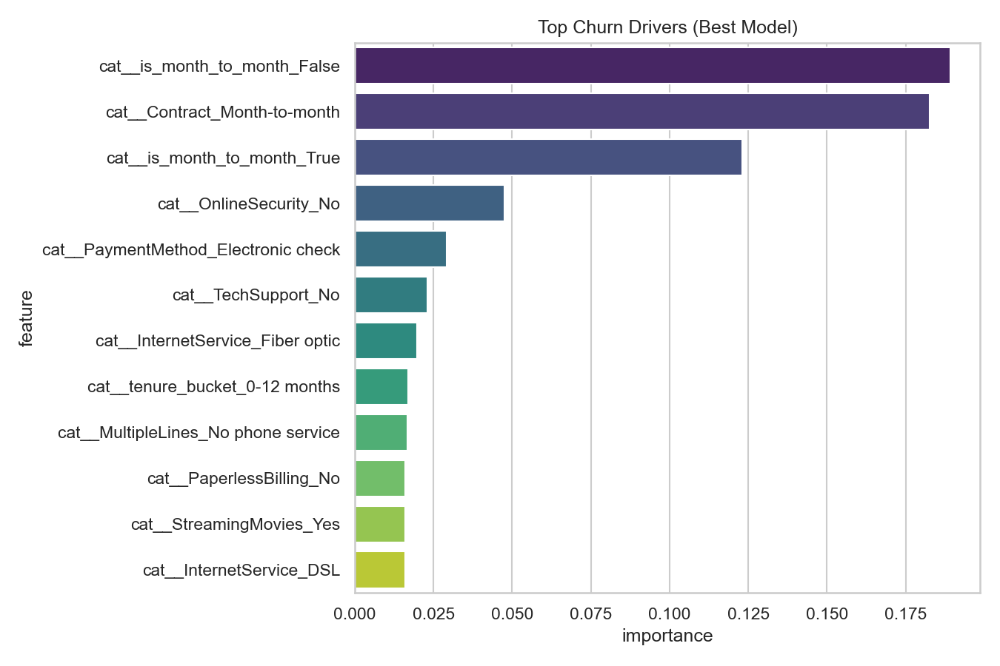

# ChurnLens


**[🚀 View Live Demo](https://customer-churn-analytics-and-prediction-jw5dxwma2wtfhsus3u7jmw.streamlit.app/)**

A portfolio-ready telecom churn analytics project demonstrating SQL, Python data science, machine learning, and executive dashboard design.



## Project Overview

A telecom company is losing customers to churn. This project:

1. Identifies factors driving churn
2. Predicts customers likely to churn
3. Quantifies revenue impact
4. Delivers actionable retention recommendations
5. Delivers an interactive **Streamlit** executive dashboard

## Dataset

**Source:** [IBM Telco Customer Churn](https://github.com/IBM/telco-customer-churn-on-icp4d)

| Column | Description |
|--------|-------------|
| `customerID` | Unique customer identifier |
| `gender`, `SeniorCitizen`, `Partner`, `Dependents` | Demographics |
| `tenure` | Months as a customer |
| `Contract` | Month-to-month, One year, Two year |
| `InternetService` | DSL, Fiber optic, No |
A telecom company is losing customers to churn. This project:

1. Identifies factors driving churn
2. Predicts customers likely to churn
3. Quantifies revenue impact
4. Delivers actionable retention recommendations
5. Delivers an interactive **Streamlit** executive dashboard

## Dataset

**Source:** [IBM Telco Customer Churn](https://github.com/IBM/telco-customer-churn-on-icp4d)

| Column | Description |
|--------|-------------|
| `customerID` | Unique customer identifier |
| `gender`, `SeniorCitizen`, `Partner`, `Dependents` | Demographics |
| `tenure` | Months as a customer |
| `Contract` | Month-to-month, One year, Two year |
| `InternetService` | DSL, Fiber optic, No |
| `MonthlyCharges`, `TotalCharges` | Revenue fields |
| `PaymentMethod` | Billing method |
| **`Churn`** | **Target:** Yes / No |

Raw data: `data/raw/Telco-Customer-Churn.csv`

## Tech Stack

### Core & Data Processing
* **Python (3.11):** The primary programming language.
* **Pandas:** Data ingestion, cleaning, manipulation, and feature engineering.
* **SciPy:** Statistical significance testing (Chi-square and Mann-Whitney U tests).

### Machine Learning & Explainable AI
* **scikit-learn:** Preprocessing pipelines, model evaluation, and baseline models.
* **XGBoost:** Primary candidate model chosen for tabular classification.
* **Optuna:** Bayesian hyperparameter tuning.
* **imbalanced-learn (SMOTE):** Synthetic minority oversampling inside cross-validation splits.
* **SHAP:** Model explainability (global importance and per-customer waterfall charts).

### Web Layer & API
* **FastAPI:** REST API endpoints (single prediction, batch CSV upload, health check).
* **Pydantic:** Request/response data validation and schema definitions.
* **Streamlit:** 6-tab interactive executive dashboard.
* **Plotly:** Interactive data visualizations (bar charts, heatmaps, histograms).

### Database & Migrations
* **PostgreSQL (16):** Production-ready relational database for OLAP analytics.
* **SQLAlchemy:** Python ORM used to map data structures to database tables.
* **Alembic:** Schema migration version control.

### DevOps, MLOps, & Tooling
* **MLflow:** Experiment tracking (hyperparameters, metrics, and model artifact logging).
* **Docker & Docker Compose:** Containerization and multi-service deployments (API, Dashboard, Database).
* **GitHub Actions:** CI/CD pipeline runner.
* **Ruff / Mypy / Pytest:** Linting, static type checking, and integration testing.

## Repository Structure

```text
customer-churn-analytics/
├── data/
│   ├── raw/
│   └── processed/
├── notebooks/
├── sql/
├── dashboard/
├── reports/
├── models/
├── images/
├── src/
├── scripts/
├── run_pipeline.py
└── README.md
```

## Quick Start

```bash
# Install dependencies (Windows)
py -m pip install -r requirements.txt

# Run end-to-end pipeline
py run_pipeline.py
py scripts/score_all_customers.py

# Launch interactive dashboard
py -m streamlit run app.py

# Optional: load into PostgreSQL
# Set DATABASE_URL then run:
py scripts/load_to_postgres.py
```

Open notebooks in order:

1. `notebooks/01_data_cleaning.ipynb`
2. `notebooks/02_eda.ipynb`
3. `notebooks/03_ml_modeling.ipynb`

## Data Cleaning Process

| Step | Method |
|------|--------|
| Missing `TotalCharges` | Convert to numeric; impute with `MonthlyCharges` when `tenure = 0` |
| Duplicates | Remove duplicate `customerID` |
| Outliers | IQR analysis; retained as valid business cases |
| Validation | Keep valid `Churn` values and non-negative tenure |
| Types | Standardize numeric and categorical fields |

Quality report: `reports/data_quality_report.csv`

## SQL Analysis

PostgreSQL scripts in `sql/`:

- `01_schema.sql` — table definition
- `02_load_data.sql` — bulk load instructions
- `03_analysis_queries.sql` — KPIs, segments, revenue, risk segments

**Example insights from SQL-ready data:**

- Overall churn rate: **26.54%**
- Month-to-month contracts are the highest-risk segment
- Electronic check payment method correlates with elevated churn

## Exploratory Data Analysis

Key metrics:

| Metric | Value |
|--------|------:|
| Total customers | 7,043 |
| Churned customers | 1,869 |
| Monthly revenue (active) | $316,986 |
| Revenue lost to churn | $139,131 |
| Average CLV | $2,280 |



## Feature Engineering

| Feature | Description |
|---------|-------------|
| `tenure_bucket` | 0–12, 12–24, 24–48, 48+ months |
| `spending_category` | Low / Medium / High (tertiles of monthly charges) |
| `estimated_clv` | `tenure × MonthlyCharges` |
| `is_month_to_month` | Boolean contract flag |
| `age_group` | Senior vs Non-Senior |

## Machine Learning Results

| Model | Accuracy | Precision | Recall | F1 | ROC-AUC |
|-------|---------:|----------:|-------:|---:|--------:|
| **Logistic Regression** | 79.91% | 65.22% | 52.14% | 57.95% | **84.25%** |
| XGBoost | 79.13% | 63.42% | 50.53% | 56.25% | 83.68% |
| Random Forest | 78.28% | 61.56% | 48.40% | 54.19% | 82.50% |

**Selected model:** Logistic Regression — best ROC-AUC and interpretable coefficients for business stakeholders.



Outputs:

- `models/best_model.pkl`
- `models/predictions.csv`
- `models/model_metrics.json`

## Business Recommendations

1. **Retention offers** for high-value customers with churn probability > 0.7
2. **Contract migration** incentives for month-to-month subscribers after 6 months
3. **Payment modernization** targeting electronic check users
4. **90-day onboarding** program for customers in first year of tenure
5. **Fiber bundle review** to address value perception gaps

Full report: `reports/business_report.md` | PDF: `reports/business_report.pdf` (run `py scripts/export_business_report_pdf.py`)

## GitHub

Push instructions: `GITHUB_SETUP.md`

## Finish the project

**Full checklist (build → publish to web → GitHub):** `COMPLETE_PROJECT_CHECKLIST.md`

## Live Dashboard (Streamlit)

Interactive dashboard with 4 tabs: Executive Overview, Churn Analysis, Revenue Insights, Churn Prediction.

```powershell
py -m streamlit run app.py
```

**Deploy free live URL:** `STREAMLIT_DEPLOY.md` → [Streamlit Community Cloud](https://share.streamlit.io)

| Feature | Details |
|---------|---------|
| KPI cards | Customers, churn rate, revenue, CLV, high-risk count |
| Filters | Contract, internet service, spending category |
| ML view | Top 100 at-risk customers, probability distribution, feature importance |

Optional Power BI guides remain in `dashboard/` if you want a second BI tool on your resume.

## Resume Bullets

- **Deployed** a 6-tab executive analytics dashboard — **visualizing $316,986 active revenue, $139,131 monthly churn loss, and 26.54% churn rate across 7,043 customers** — by building interactive filter-driven pages with cached data loading and per-customer deep-dive views (using **Streamlit** as the front-end framework with `@st.cache_data` for DataFrame caching, **Plotly** for interactive charts, and **SHAP** explainability library for per-customer churn-driver visualizations).
- **Validated** churn drivers with statistical rigor — **proving 22 of 24 customer attributes are statistically significant (p < 0.05), with Contract type as the strongest predictor (Cramér's V = 0.410)** — by building an automated significance testing engine that runs Chi-Square tests on categorical features and Mann-Whitney U tests on continuous features with effect-size calculations (using **SciPy** `chi2_contingency` and `mannwhitneyu`).
- **Designed** a denormalized analytics schema with 4 targeted indexes and 10+ pre-built SQL queries — **covering KPI aggregations, segment-level churn rates, and revenue-loss breakdowns by contract type, payment method, and tenure cohort** — by writing PostgreSQL DDL with index alignment to GROUP BY query patterns, and applying a `HAVING COUNT(*) >= 50` statistical minimum to filter out noisy small segments (using **PostgreSQL 16**, **SQLAlchemy ORM**, and **Alembic**).
- **Reduced** potential churn-driven revenue loss of $139,131/month — **by shifting the classification threshold from 0.5 to 0.1566, boosting recall from ~50% to 95.19%** — by implementing an asymmetric cost function (FN × $45 + FP × $5) that evaluates business cost at every precision-recall curve point and selects the threshold minimizing total dollar loss (using **scikit-learn** precision-recall curve and confusion matrix APIs).

## License

Educational portfolio project. Dataset © IBM (open sample data).